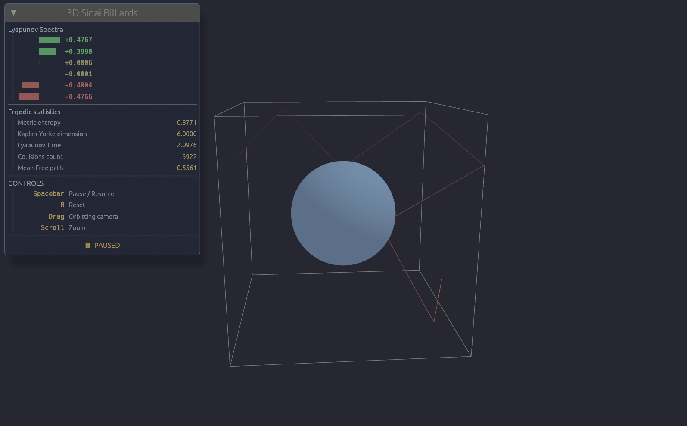

# 3D Sinai Billiards Ergodic Dynamics

A simple live rendering and ergodic statistics computation to a 3D extension of the [Sinai billiards](https://en.wikipedia.org/wiki/Dynamical_billiards#Lorentz_gas,_a.k.a._Sinai_billiard) Dynamical System with Rust and WebGPU.

## Chaotic System setup and computation
The dynamical system model is a unit speed (actually unit momenta) ray reflecting with elastic collision within a 3D box $[0, L]^3$ that encloses a spherical scatterer. With this, we can approximate in real-time a few notable ergodic quantities and more statistics such as 
- ___The spectrum of [Lyapunov exponents](https://en.wikipedia.org/wiki/Lyapunov_exponent)___: via estimating the singular values of the system's coordinate frame evolution in the phase space (cotangent space).
- ___Kolmogorov-Sinai entropy (or equivalently, the metric entropy)___: with applying the [Pesin's Entropy Formula](http://www.scholarpedia.org/article/Pesin_entropy_formula) on the full Lyapunov spectra.
- ___[Mean-free path](https://en.wikipedia.org/wiki/Mean_free_path)___ of the trajectory in the box.

## Requirements and Usage
- Install `rust` via [rustup](https://rust-lang.org/tools/install/).
- (If you want to make an update to the Slang [shader source](src/shaders/shaders.slang)) Install a [release](https://shader-slang.org/tools/) of the `slangc` shader compiler for the Slang shading language and compile to WGSL with `./scripts/compile-shaders.sh` or use the [guide](https://shader-slang.org/slang/user-guide/compiling).
- Build and run with `cargo run --release`.
