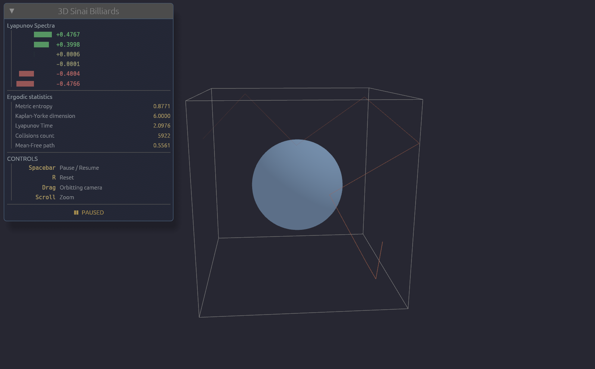

# 3D Sinai Billiards Ergodic Dynamics

Real-time rendering and ergodic statistics computation to a 3D extension of the [Sinai billiards](https://en.wikipedia.org/wiki/Dynamical_billiards#Lorentz_gas,_a.k.a._Sinai_billiard) Dynamical System with Rust and WebGPU framework.



## Chaotic System setup and computation
This 3D Sinai Billiards dynamical system model is a unit speed, unit momentum particle ray reflecting with elastic collision within a 3D box $[0, L]^3$ that encloses a spherical scatterer. With this, there are a few notable ergodic quantities and statistics that can be approximated in real-time such as, but not limited to:
- ___The spectrum of [Lyapunov exponents](https://en.wikipedia.org/wiki/Lyapunov_exponent)___: via estimating the singular values of the system's coordinate frame evolution in the phase space (cotangent bundle).
- ___Kolmogorov-Sinai entropy (metric entropy)___: with applying (an extension of) the [Pesin's Entropy Formula](http://www.scholarpedia.org/article/Pesin_entropy_formula) on the full Lyapunov spectra.
- ___[Mean-free path](https://en.wikipedia.org/wiki/Mean_free_path)___ of the trajectory in the box.

## Graphics and Rendering
The live visualization of the dynamical system is built on top of the Rust [wgpu](https://wgpu.rs/) library for direct access and control over the modern graphics pipeline following the WebGPU framework. Despite that, the shader development is not limited to WGSL as most of the shader programs are written in the [Slang](https://shader-slang.org/) shading language which are then compiled to a Slang supported target language (currently supporting both WGSL and SPIR-V) as part of the project pipeline to provide a portable and more robust shaders developing experience.

***Note:*** Due to `wgpu` crate breaking changes between versions, note that the program is currently supported on exactly `v29` API.

Finally, as this is also a personal project, on top of making a high-performance render, I also just want to tryout and implement many elements of modern graphics techniques which includes a 4x Multi Sample Anti-Aliasing (MSAA) build directly into the rendering pipelines and plans to expand with hardware raytracing once the API support is more stable and mature.

## Requirements and Usage
- Install `rust` via [rustup](https://rust-lang.org/tools/install/).
- (If you want to make an update to the Slang [shader source](src/shaders/)) Install a [release](https://shader-slang.org/tools/) of the `slangc` shader compiler for the Slang shading language and compile to WGSL with `./scripts/compile-shaders.sh` or use the [guide](https://shader-slang.org/slang/user-guide/compiling).
- Build and run with `cargo run --release` with the following options for command-line interface
```
$ ./target/release/sinai-billiards-3d -h
CLI Arguments

Usage: sinai-billiards-3d [OPTIONS]

Options:
  -b, --box-size <BOX_SIZE>
          Enclosing box size [default: 1]
  -r, --radius <RADIUS>
          Encapsulated spherical scatterer radius [default: 0.25]
      --history <HISTORY>
          Particle trajectory collision history on display [default: 10]
      --steps-per-frame <STEPS_PER_FRAME>
          Simulation steps per rendering frame [default: 1]
      --shader-type <SHADER_TYPE>
          Static shader source type [default: wgsl] [possible values: wgsl, spirv]
  -h, --help
          Print help
```
